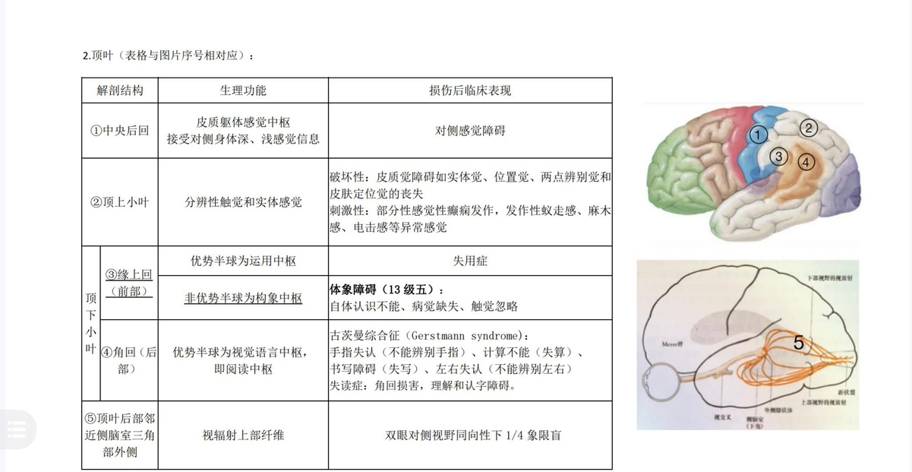
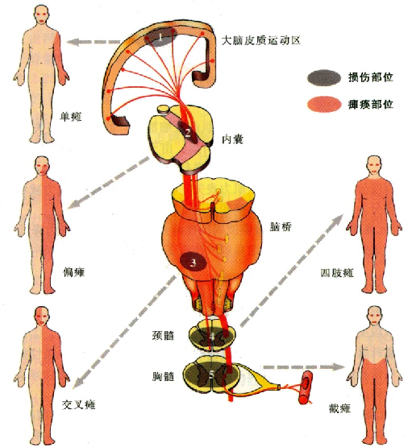

# 第二章 神经系统的解剖、生理及病损的定位诊断
中枢系统大脑分为：端脑，间脑，脑干，小脑
	脑干还可以分三个结构：中脑、脑桥、延髓（与脊髓相连）
**非优势半球**
	多为右侧大脑半球
	音乐、美术、综合能力、空间、几何图形和人物面容的识别及视觉记忆功能等方面占优势
	**体象障碍**病变多位于非优势半球**顶叶**。体象障碍指患者基本感知功能正常，但对自身躯体的存在、空间位置及各部位之间的关系失去辨别能力
		偏侧忽视：对病变**对侧**的空间和物体不注意、不关心、似与己无关
		病觉缺失：对**对侧**肢体的偏瘫全然否认，甚至当把偏瘫肢体出示给患者时，仍否认瘫痪的存在
		手指失认：指不能辨别自己的双手手指和其名称
		自体认识不能：患者否认**对侧**肢体的存在，或认为**对侧**肢体不是自己的
		幻肢现象：患者认为自己的肢体已不复存在，或感到自己的肢体多出了一个或数个
**优势半球**
	多数为左半球
	四个语言区（大脑皮质语言功能区）： 运动性语言中枢（说话中枢）、听觉性语言中枢（听话中枢）、书写中枢、视觉性语言中枢（阅读中枢）
	病变产生**失语**
	==Gerstmann综合症==多见于**优势半球顶叶角回**，主要表现有：计算不能（失算症）、手指失认、左右辨别不能（左右失认）、书写不能（失写症）等，有时伴失读
**构音障碍**常见于和发音相关的中枢神经（迷走、舌下、舌咽、面神经）、周围神经（脊神经）或肌肉疾病（重症肌无力等）
额叶（精神、语言、随意运动）
	额极--精神中枢（调控情绪）
枕叶（视觉）
	弱视
	舌回和楔回--象限盲
岛叶（内脏）
颞叶（听觉）
	颞上回后部--感觉性失语
	颞中回后部--命名性失语
	额下回后部--运动性失语
顶叶（皮质性感觉）
	失认

中央前回是大脑皮质运动区，该区大锥体细胞的轴突构成了锥体束的大部，支配**对侧**半身的随意运动，刺激性病变可导致对侧上下肢或面部的抽搐（Jackson癫痫）或继发全身性癫痫发作；破坏性病变多引起单瘫
	中央前回上部受损产生对侧下肢瘫痪
	中央前回下部受损产生对侧面、舌或上肢的瘫
内囊：大量的上下行传导束，特别是锥体束在此高度集中，如完全损害，病灶**对侧**可出现偏瘫、偏身感觉障碍及偏盲，谓之‘三偏’综合征（完全性均等性偏瘫）
	锥体束：皮质脊髓束（从大脑皮质至脊髓前角的纤维束）和皮质脑干束（从大脑皮质至脑干神经运动核的纤维束，损害出现病灶对侧中枢性面瘫）
	脑出血、脑梗死
	脊髓丘脑束--肢体感觉
	薄束楔束--深感觉
脑干：病变大都出现**交叉性瘫痪**，即病灶侧脑神经周围性瘫痪和对侧肢体中枢性瘫痪及感觉障碍
脊髓损伤
	**高颈髓损害**平面以下各种感觉缺失，四肢呈上运动神经元性瘫痪（四肢瘫）
	**胸髓脊髓**节段血供较差而最易发病的部位，损害时，该平面以下各种感觉缺失，双下肢呈上运动神经元性瘫痪
		**脊髓横贯性损害**，因双侧锥体束受损而出现双侧肢体的瘫痪，如截瘫或四肢瘫
	**颈膨大**两上肢呈下运动神经元性瘫痪，两下肢呈上运动神经元性瘫痪
	**脊髓半切综合征**，病变节段以下**同侧**（一侧）上运动神经元性瘫痪
皮质红核束属于纹状体系统，顶枕颞桥束和额桥束属于前庭小脑系统，这两个系统共同组成锥体外系统，病损后主要出现肌张力变化和不自主运动两大类症状

丘脑（丘脑为网状上行系统的组成部分，受累后可引起意识障碍；丘脑综合征，主要为对侧的感觉缺失和刺激症状，对侧不自主运动，并可有情感与记忆障碍）
	外侧核群尤其是腹后外侧核和腹后内侧核受损产生**对侧偏身感觉障碍**，具有如下特点：①各种感觉均发生障碍；②深感觉和精细触觉障碍重于浅感觉；③肢体及躯干的感觉障碍重于面部；④可有深感觉障碍所导致的共济失调；⑤感觉异常；⑥对侧偏身**自发性疼痛（丘脑痛）**，疼痛部位弥散、不固定
	下丘脑是调节内脏活动和内分泌活动的皮质下中枢
	上丘脑的病变常见于松果体肿瘤，可出现由肿瘤压迫中脑四叠体而引起的帕里诺综合征
	丘脑底核损害时可出现对侧以上肢为重的舞蹈运动，表现为连续的不能控制的投掷运动，称偏身投掷运动
小脑病变多出现眩晕、姿势异常、平衡障碍等共济失调的症状
脑桥不同部位病变有不同表现，共同表现有病灶侧眼球不能外展（展神经麻痹）、周围性面神经麻痹（面神经核损害）
延髓损害时可表现为延髓背外侧综合征（眩晕、恶心、呕吐、Honer综合征等表现）或延髓内侧综合征（对侧肢体中枢性瘫痪等表现）
基底核病变主要产生运动异常和肌张力改变